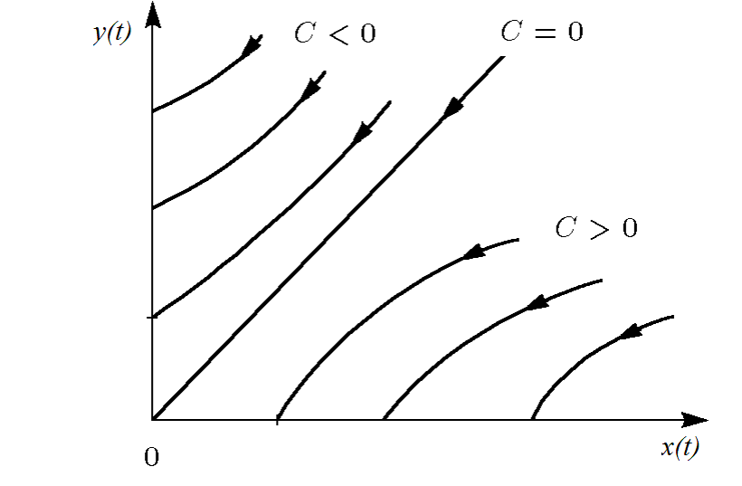

---
## Author
author:
  name: Абдуллахи Шугофа
  email: 1032225505@rudn.ru
  affiliation:
    - name: Российский университет дружбы народов
      country: Российская Федерация
      postal-code: 117198
      city: Москва
      address: ул. Миклухо-Маклая, д. 6

## Title
title: "Математическое моделирование"
subtitle: "Лабораторная работа № 3"
license: "CC BY"
---

# Цель работы

В рамках данной лабораторной работы рассматриваются простейшие математические модели вооружённого противоборства — модели Ланчестера. В конфликте могут участвовать как регулярные военные формирования, так и нерегулярные (партизанские) силы. Основной характеристикой каждой стороны является численность войск. Если в процессе развития конфликта численность одной из сторон становится равной нулю, то считается, что эта сторона потерпела поражение, при условии, что у противника численность остаётся положительной.

# Задание

1. Рассмотреть три варианта моделей Ланчестера.
2. Построить графики изменения численности войск во времени.
3. Определить сторону, одержавшую победу.

# Выполнение лабораторной работы

## Теоретические сведения

Рассмотрим три различных сценария ведения боевых действий:

1. столкновение двух регулярных армий;
2. противостояние регулярных войск и партизанских формирований;
3. конфликт между партизанскими отрядами.

### Модель для регулярных войск

Численность регулярной армии определяется несколькими факторами:

1. естественное уменьшение численности (болезни, травмы, дезертирство);
2. потери, вызванные боевыми действиями;
3. поступление подкреплений.

В этом случае динамика численности войск описывается системой дифференциальных уравнений

$$
\begin{cases}
\frac{dx}{dt}= -a(t)x(t) - b(t)y(t) + P(t)
\\
\frac{dy}{dt}= -c(t)x(t) - h(t)y(t) + Q(t)
\end{cases}
$$

Здесь члены $-a(t)x(t)$ и $-h(t)y(t)$ отражают потери, не связанные непосредственно с боевыми действиями. Слагаемые $-b(t)y(t)$ и $-c(t)x(t)$ характеризуют потери, возникающие в ходе боевого столкновения.  

Коэффициенты $b(t)$ и $c(t)$ определяют эффективность боевых действий сторон, а параметры $a(t)$ и $h(t)$ отражают влияние дополнительных факторов, уменьшающих численность войск. Функции $P(t)$ и $Q(t)$ описывают поступление подкреплений.

### Модель регулярных войск и партизан

Во втором сценарии одна из сторон ведёт партизанскую войну. Нерегулярные формирования обладают большей скрытностью, поэтому воздействие регулярной армии носит менее точечный характер. Потери партизан пропорциональны как численности регулярных войск, так и численности самих партизан.

Соответствующая система имеет вид

$$
\begin{cases}
\frac{dx}{dt}= -a(t)x(t) - b(t)y(t) + P(t)
\\
\frac{dy}{dt}= -c(t)x(t)y(t) - h(t)y(t) + Q(t)
\end{cases}
$$

### Модель партизанских формирований

Если обе стороны ведут партизанскую борьбу, то взаимодействие описывается системой

$$
\begin{cases}
\frac{dx}{dt}= -a(t)x(t) - b(t)x(t)y(t) + P(t)
\\
\frac{dy}{dt}= -h(t)y(t) - c(t)x(t)y(t) + Q(t)
\end{cases}
$$

### Упрощённая модель Ланчестера

В простейшем варианте предполагается, что коэффициенты $b$ и $c$ постоянны, а также отсутствуют подкрепления и дополнительные потери. Тогда система принимает вид

$$
\begin{cases}
\frac{dx}{dt}= -by
\\
\frac{dy}{dt}= -ax
\end{cases}
$$

Состояние системы определяется точкой $(x,y)$ на плоскости, где $x$ и $y$ — численности противоборствующих армий.

Данная система допускает аналитическое решение

$$
\frac{dx}{dy}=\frac{by}{cx}
$$

$$
cxdx=bydy
$$

$$
cx^2 - by^2 = C
$$

Траектории системы представляют собой гиперболы. Начальные условия определяют, по какой из них будет развиваться динамика конфликта.

{ #fig:001 width=70% height=70% }

Гиперболы разделяются прямой

$$
\sqrt{cx}=\sqrt{by}
$$

Если начальная точка располагается выше этой линии, то армия $y$ одерживает победу. Если ниже — выигрывает армия $x$. На самой линии происходит взаимное истощение сил, и конфликт может продолжаться бесконечно долго.

Из модели следует важный вывод: чтобы компенсировать численное превосходство противника, необходимо значительно более эффективное вооружение. Например, при двукратном превосходстве противника требуется четырёхкратное увеличение эффективности оружия.

Следует помнить, что такая модель сильно идеализирована и используется главным образом для теоретического анализа.

### Модель регулярных войск и партизан (упрощённый вариант)

Если рассмотреть второй сценарий в упрощённой форме, получим систему

$$
\begin{cases}
\frac{dx}{dt}= -by(t)
\\
\frac{dy}{dt}= -cx(t)y(t)
\end{cases}
$$

Она сводится к выражению

$$
\frac{d}{dt}\left(\frac{b}{2}x^2(t)-cy(t)\right)=0
$$

Отсюда следует

$$
\frac{b}{2}x^2(t)-cy(t)=\frac{b}{2}x^2(0)-cy(0)=C_1
$$

{ #fig:002 width=70% height=70% }

Если $C_1>0$, то победу одерживают регулярные войска, а при $C_1<0$ преимущество получают партизанские силы.

## Задача

Между государствами $X$ и $Y$ происходит вооружённый конфликт. Численность их армий зависит от времени и обозначается функциями $x(t)$ и $y(t)$.

В начальный момент:

- армия страны $X$ составляет $32888$ человек;
- армия страны $Y$ составляет $17777$ человек.

Предполагается, что коэффициенты $a$, $b$, $c$, $h$ постоянны, а функции $P(t)$ и $Q(t)$ являются непрерывными.

Требуется построить графики изменения численности армий в следующих ситуациях.

### 1. Модель регулярных армий

$$
\begin{cases}
\frac{dx}{dt}= -0.55x(t) - 0.77y(t) + 1.5\sin(3t+1)
\\
\frac{dy}{dt}= -0.66x(t) - 0.44y(t) + 1.2\cos(t+1)
\end{cases}
$$

### 2. Модель регулярных войск и партизан

$$
\begin{cases}
\frac{dx}{dt}= -0.27x(t) - 0.88y(t) + \sin(20t)
\\
\frac{dy}{dt}= -0.68x(t)y(t) - 0.37y(t) + \cos(10t)
\end{cases}
$$

Для численного моделирования и построения графиков использовались отдельные программные файлы:





## Базовые эксперименты

### Линейная модель (model_type = linear)

На графике представлена эволюция функций $x(t)$ и $y(t)$ в рамках линейной модели. Обе переменные постепенно уменьшаются по мере роста времени.

Функция $x(t)$ убывает достаточно плавно и остаётся положительной на всём интервале интегрирования. Это указывает на постепенное ослабление системы без резких изменений.

Функция $y(t)$ снижается быстрее и к концу рассматриваемого промежутка времени почти достигает нулевого значения. Подобное поведение характерно для линейных дифференциальных систем, где решения экспоненциально стремятся к устойчивому состоянию.

### Нелинейная модель (model_type = nonlinear)

В нелинейной системе динамика существенно отличается. Функция $x(t)$ уменьшается значительно медленнее и сохраняет относительно большие значения на протяжении всего интервала времени.

При этом переменная $y(t)$ практически сразу стремится к нулю. После начального этапа её значение остаётся близким к нулевому.

Такое поведение обусловлено наличием нелинейных членов в системе уравнений, которые усиливают скорость подавления одной из переменных.

## Параметрическое сканирование

### Траектории $x(t)$ при различных параметрах

Было выполнено параметрическое исследование модели. Для линейной системы изменялся параметр $a$, а для нелинейной — параметр $a_2$.

Наблюдения показывают, что увеличение параметра приводит к ускоренному уменьшению функции $x(t)$.

Основные выводы:

- при малых значениях параметра спад функции происходит медленно;
- при больших значениях кривые становятся более крутыми;
- различия между траекториями заметны уже в середине временного интервала.

### Траектории $y(t)$ при различных параметрах

Аналогичное исследование было выполнено для функции $y(t)$.

В линейной системе изменение параметра постепенно изменяет форму траектории. С увеличением параметра функция быстрее стремится к нулю.

В нелинейной модели ситуация иная: значение $y(t)$ практически сразу становится близким к нулю независимо от параметра. Это связано с сильным влиянием нелинейных членов системы.

## Время вычислений

Было проведено измерение времени численного решения системы уравнений при различных параметрах.

Полученные результаты показывают:

- линейная модель решается значительно быстрее;
- время вычисления линейной системы составляет порядка $10^{-5}$ секунд;
- нелинейная система требует около $7\cdot10^{-4}$–$9\cdot10^{-4}$ секунд.

Несмотря на различие, оба значения крайне малы и не создают ограничений для практического моделирования.

## Анализ итоговой метрики norm_final

В качестве итоговой характеристики была использована величина

$$
\text{norm\_final} = \sqrt{x(t_{final})^2 + y(t_{final})^2}
$$

Она показывает величину состояния системы в конце интервала моделирования.

Анализ показывает:

- при увеличении параметра значение метрики уменьшается;
- линейная система быстрее приближается к состоянию покоя;
- в нелинейной модели остаточное значение состояния выше.

Это свидетельствует о более медленном затухании динамики в нелинейной системе.

# Выводы

1. Линейная модель демонстрирует устойчивое и предсказуемое уменьшение переменных. Значения $x(t)$ и $y(t)$ постепенно снижаются, причём $y(t)$ стремится к нулю быстрее.

2. В нелинейной системе наблюдается иная динамика: переменная $y(t)$ быстро исчезает, после чего система фактически определяется только переменной $x(t)$.

3. Изменение параметров оказывает заметное влияние на скорость затухания решений, особенно в линейной модели.

4. В нелинейной системе влияние параметров на переменную $y(t)$ выражено значительно слабее.

5. Численные эксперименты показывают, что вычисления для линейной модели выполняются быстрее, однако время расчёта для обеих систем остаётся крайне малым.

6. Метрика $\text{norm\_final}$ уменьшается при увеличении параметров, что отражает усиление затухания динамики системы.

Полученные результаты соответствуют ожидаемому поведению линейных и нелинейных дифференциальных моделей и подтверждают корректность проведённого численного анализа.

# Список литературы {.unnumbered}

1. [Законы Осипова — Ланчестера](https://ru.wikipedia.org/wiki/Законы_Осипова_—_Ланчестера)  
2. [Дифференциальные уравнения динамики боя](https://zen.yandex.ru/media/id/5fd3c685994c494848984b63/differencialnye-uravneniia-dinamiki-boia-5fd4bcc45a2c8e1f2cc208f1)  
3. [Элементарные модели боя](https://intuit.ru/studies/educational_groups/594/courses/499/lecture/11353?page=7)
