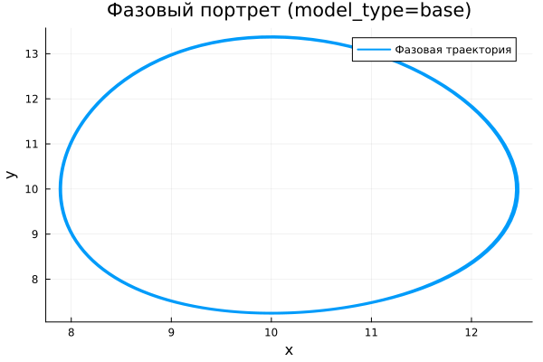

---
## Author
author:
  name: Абдуллахи Шугофа
  email: 1032225505@rudn.ru
  affiliation:
    - name: Российский университет дружбы народов
      country: Российская Федерация
      postal-code: 117198
      city: Москва
      address: ул. Миклухо-Маклая, д. 6

## Title
title: "Математическое моделирование"
subtitle: "Лабораторная работа № 5"
license: "CC BY"
date: today
date-format: "YYYY-MM-DD"
---

# Вводная часть

## Цель работы

Проанализировать модель «хищник–жертва» и исследовать особенности её поведения в различных модификациях.

## Задание

1. Построить зависимость численности хищников от численности жертв  
2. Построить временные графики изменения популяций  
3. Определить положение равновесия  
4. Провести сравнение базовой и модифицированной моделей  
5. Выполнить анализ влияния параметров  

# Теоретические сведения

## Модель хищник-жертва

Рассматривается система Лотки–Вольтерры, описывающая взаимодействие двух популяций.

Обозначим:

- $x(t)$ — численность хищников  
- $y(t)$ — численность жертв  

Тогда динамика задаётся системой:

$$
\begin{cases}
\frac{dx}{dt} = -ax(t) + b x(t)y(t), \\
\frac{dy}{dt} = c y(t) - d x(t)y(t)
\end{cases}
$$

## Интерпретация параметров

Коэффициенты имеют следующий смысл:

- $a$ — естественное уменьшение численности хищников  
- $b$ — рост хищников за счёт взаимодействия  
- $c$ — естественный рост жертв  
- $d$ — убывание жертв из-за хищников  

Изменение этих параметров существенно влияет на поведение системы.

## Стационарное состояние

Равновесие определяется условиями:

$$
\frac{dx}{dt}=0, \qquad \frac{dy}{dt}=0
$$

Откуда при положительных значениях переменных:

$$
x_0=\frac{a}{b}, \qquad y_0=\frac{c}{d}
$$

Это состояние соответствует балансу между популяциями.

# Постановка задачи

## Исследуемая система

Рассматривается система:

$$
\begin{cases}
\frac{dx}{dt} = -0.25x(t) + 0.025x(t)y(t), \\
\frac{dy}{dt} = 0.45y(t) - 0.045x(t)y(t)
\end{cases}
$$

## Начальные условия

Начальные значения:

$$
x_0 = 8, \qquad y_0 = 11
$$

## Стационарное состояние системы

Подставляя коэффициенты, получаем:

$$
x_0=\frac{0.25}{0.025}=10, \qquad y_0=\frac{0.45}{0.045}=10
$$

Таким образом, равновесие достигается в точке:

$$
(10, 10)
$$

# Базовые эксперименты

## Базовая модель: временные зависимости

## Базовая модель: фазовый портрет

## Базовая модель: анализ

В данной модели наблюдаются устойчивые циклические изменения.

Характерные особенности:

- периодичность поведения обеих переменных  
- практически неизменная амплитуда  
- отсутствие стремления к равновесию  
- замкнутые фазовые траектории  

Следовательно, система реализует незатухающий колебательный режим.

## Расширенная модель: временные зависимости

## Расширенная модель: фазовый портрет

## Расширенная модель: анализ

В модифицированной модели динамика меняется качественно.

Наблюдается:

- значительные колебания в начальный момент  
- постепенное уменьшение амплитуды  
- переход к устойчивому режиму  
- спиральная структура фазовых траекторий  

Таким образом, введение нелинейного ограничения стабилизирует систему.

# Параметрическое исследование

## Сканирование траекторий $x(t)$

## Анализ траекторий $x(t)$

Проведён анализ влияния параметров.

Выводы:

- в базовой модели параметр $a$ изменяет форму колебаний, не нарушая их природы  
- динамика остаётся периодической  
- в расширенной модели параметр $k$ регулирует скорость затухания  
- увеличение $k$ ускоряет переход к равновесию  

## Сканирование траекторий $y(t)$

## Анализ траекторий $y(t)$

Для переменной $y(t)$ наблюдается аналогичное поведение:

- базовая модель демонстрирует устойчивую периодичность  
- расширенная модель приводит к затуханию колебаний  
- усиление нелинейного эффекта ускоряет стабилизацию  
- система стремится к устойчивому состоянию  

## Фазовые траектории

## Анализ фазовых траекторий

Сравнение фазовых портретов показывает:

- базовая модель — замкнутые траектории  
- расширенная модель — спиральное приближение к равновесию  
- различие носит фундаментальный характер  

Это подтверждает различную природу динамики.

# Анализ итоговой метрики

## Метрика norm_final

Рассматривается величина:

$$
\text{norm\_final} = \sqrt{x(t_{final})^2 + y(t_{final})^2}
$$

Она отражает состояние системы в конечный момент времени.

## Зависимость norm_final от параметра

## Интерпретация результата

Анализ показывает:

- в базовой модели значение метрики остаётся значительным из-за незатухающих колебаний  
- в расширенной модели метрика определяется положением устойчивого состояния  
- после затухания система приближается к равновесию  

Таким образом, метрика позволяет различать типы динамики.

# Анализ вычислений

## Время вычислений

## Интерпретация времени вычислений

Результаты показывают:

- обе модели вычисляются быстро  
- время расчёта остаётся малым  
- изменение параметров почти не влияет на затраты  
- усложнение модели не приводит к значительным вычислительным потерям  

Следовательно, используемый численный метод является эффективным.

# Итоги

## Выводы

1. Базовая модель демонстрирует устойчивые периодические колебания без затухания  
2. Расширенная модель приводит к стабилизации системы  
3. Фазовые портреты отражают различие между циклическим и сходящимся поведением  
4. Параметры $a$ и $k$ влияют на динамические характеристики  
5. Метрика $\text{norm\_final}$ позволяет различать режимы движения  
6. Численное моделирование выполняется эффективно  
