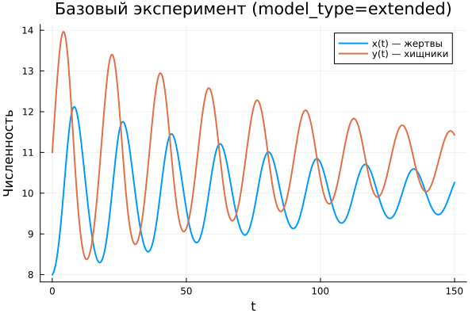

---
## Author
author:
  name: Абдуллахи Шугофа
  email: 1032225505@rudn.ru
  affiliation:
    - name: Российский университет дружбы народов
      country: Российская Федерация
      postal-code: 117198
      city: Москва
      address: ул. Миклухо-Маклая, д. 6

## Title
title: "Математическое моделирование"
subtitle: "Лабораторная работа № 5"
license: "CC BY"
---

# Цель работы

Исследовать динамику системы «хищник–жертва» и проанализировать её поведение.

# Задание

1. Построить графическую зависимость $x$ от $y$, а также графики $x(t)$ и $y(t)$  
2. Определить стационарное состояние системы  

# Выполнение лабораторной работы

## Теоретические сведения

В работе рассматривается классическая модель взаимодействия популяций типа «хищник–жертва».

Пусть имеются две популяции: $X$ — хищники, $Y$ — жертвы. Предполагается, что:

1. Численности зависят исключительно от времени (пространственное распределение не учитывается)  
2. Без взаимодействия динамика подчиняется экспоненциальным законам: жертвы растут, хищники убывают  
3. Естественная смертность жертв и рождаемость хищников несущественны  
4. Ограничение среды отсутствует  
5. Взаимодействие снижает рост жертв пропорционально численности хищников  

Математическая модель (Лотки–Вольтерры) имеет вид:

$$
\begin{cases}
\frac{dx}{dt} = -ax(t) + b x(t)y(t) \\
\frac{dy}{dt} = c y(t) - d x(t)y(t)
\end{cases}
$$

Здесь $a$ — коэффициент убывания хищников, $b$ — коэффициент их роста, $c$ — коэффициент увеличения жертв, $d$ — коэффициент их убывания.

Особый интерес представляет стационарное состояние, при котором изменения отсутствуют:

$$
\frac{dx}{dt} = 0, \quad \frac{dy}{dt} = 0
$$

При $x>0$, $y>0$ получаем:

$$
x_0 = \frac{a}{b}, \quad y_0 = \frac{c}{d}
$$

## Задача

Рассматривается система:

$$
\begin{cases}
\frac{dx}{dt} = -0.25x(t) + 0.025x(t)y(t) \\
\frac{dy}{dt} = 0.45y(t) - 0.045x(t)y(t)
\end{cases}
$$

Начальные условия: $x_0=8$, $y_0=11$

Требуется:

- построить графики $x(t)$, $y(t)$ и фазовый портрет  
- определить стационарное состояние  

Стационарная точка:

$$
x_0 = 10, \quad y_0 = 10
$$

Для численного моделирования использовались внешние программные модули:





## Базовые эксперименты

### Базовая модель (model_type = base)

Во временных зависимостях наблюдаются устойчивые колебания. Функции $x(t)$ и $y(t)$ изменяются периодически, причём амплитуда практически не уменьшается.

Такое поведение отражает классическую динамику без потерь энергии: система не стремится к равновесию, а остаётся в режиме непрерывных колебаний.

Фазовый портрет представлен замкнутой кривой, что указывает на цикличность и возврат к прежним состояниям.

### Расширенная модель (model_type = extended)

В данном случае колебания постепенно затухают. Изначально амплитуда значительна, но затем уменьшается.

Причина — наличие дополнительного члена $-k x^2$, ограничивающего рост жертв. Система теряет консервативность и переходит к устойчивому режиму.

Фазовый портрет имеет спиральную форму, сходящуюся к центру, что указывает на наличие устойчивой точки равновесия.

## Параметрическое сканирование

### Траектории $x(t)$ для различных параметров

Исследовалось влияние параметров: $a$ (базовая модель) и $k$ (расширенная модель).

В базовом варианте изменение $a$ влияет на форму колебаний, но не нарушает их периодичность.

В расширенной модели параметр $k$ определяет скорость затухания: чем больше $k$, тем быстрее система стабилизируется.

Основные выводы:

- базовая модель сохраняет колебательный характер  
- расширенная демонстрирует затухание  
- параметры влияют на динамические характеристики  

### Траектории $y(t)$ для различных параметров

Поведение аналогично: в базовой модели сохраняется периодичность, а в расширенной наблюдается переход к устойчивому уровню.

Усиление нелинейного эффекта ускоряет стабилизацию.

### Фазовые траектории для различных параметров

Фазовые портреты демонстрируют различия:

- базовая модель — замкнутые траектории  
- расширенная — спирали, сходящиеся к равновесию  

Это подтверждает различие в природе динамики систем.

## Анализ метрики norm_final

Используется метрика:

$$
\text{norm\_final} = \sqrt{x(t_{final})^2 + y(t_{final})^2}
$$

В базовой модели значение зависит от фазы колебаний и остаётся значительным.

В расширенной модели величина определяется положением устойчивого состояния.

## Время вычислений

Время расчёта остаётся малым во всех экспериментах.

Изменение параметров $a$ и $k$ практически не влияет на вычислительные затраты.

Добавление нелинейного члена не приводит к заметному усложнению вычислений.

## Выводы

1. Базовая модель характеризуется устойчивыми колебаниями без затухания  
2. Расширенная модель приводит к стабилизации системы  
3. Фазовые портреты отражают различие динамических режимов  
4. Параметры влияют на форму и скорость изменения процессов  
5. Метрика $\text{norm\_final}$ позволяет различать типы поведения  
6. Численные методы демонстрируют высокую эффективность  

# Список литературы {.unnumbered}

1. [Модель Лотки-Вольтерры](https://math-it.petrsu.ru/users/semenova/MathECO/Lections/Lotka_Volterra.pdf)  
2. [Lotka-Volterra System](https://www.sciencedirect.com/topics/mathematics/lotka-volterra-system)  
