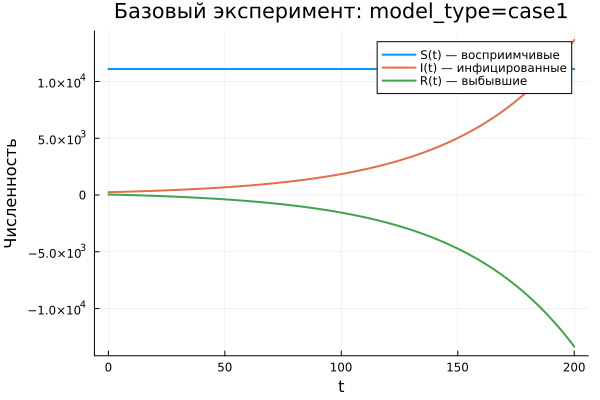
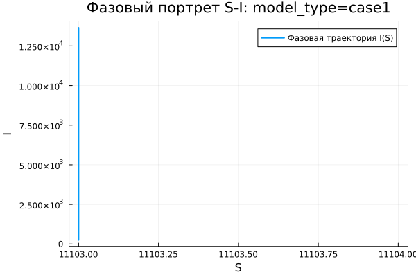

---
author:
  name: Абдуллахи Шугофа
  email: 1032225505@rudn.ru
  affiliation:
    - name: Российский университет дружбы народов
      country: Российская Федерация
      city: Москва
title: "Математическое моделирование"
subtitle: "Лабораторная работа № 6"
license: "CC BY"
date: today
date-format: "YYYY-MM-DD"
---

# Вводная часть

## Цель работы

Изучить эпидемиологическую модель $SIR$ и исследовать особенности распространения заболевания в изолированной популяции.

## Задание

1. Рассмотреть математическую модель эпидемии.
2. Построить графики изменения групп $S(t)$, $I(t)$ и $R(t)$.
3. Проанализировать два режима:
   - $I(0) \leq I^*$;
   - $I(0) > I^*$.
4. Выполнить параметрическое исследование.
5. Сравнить полученные модели по графикам и численным метрикам.

# Теоретические сведения

## Модель $SIR$

В модели $SIR$ вся популяция делится на три группы:

- $S(t)$ — восприимчивые к заболеванию;
- $I(t)$ — инфицированные и распространяющие инфекцию;
- $R(t)$ — выздоровевшие и получившие иммунитет.

Общее число особей:

$$
N = S(t) + I(t) + R(t).
$$

## Основная идея модели

Модель описывает последовательный переход между состояниями:

$$
S \rightarrow I \rightarrow R.
$$

Сначала восприимчивые особи заражаются и переходят в группу $I$. Затем инфицированные выздоравливают и переходят в группу $R$.

## Условие изоляции

До достижения критического уровня $I^*$ предполагается, что заболевшие изолированы.

Если выполняется условие

$$
I(t) \leq I^*,
$$

то новые заражения не происходят.

Если же

$$
I(t) > I^*,
$$

то инфекция начинает распространяться среди восприимчивых особей.

## Уравнение для $S(t)$

Изменение числа восприимчивых описывается уравнением:

$$
\frac{dS}{dt} =
\begin{cases}
-\alpha S, & I(t) > I^*, \\
0, & I(t) \leq I^*.
\end{cases}
$$

При превышении порога $I^*$ группа $S$ уменьшается за счёт заражения.

## Уравнение для $I(t)$

Динамика инфицированных определяется соотношением:

$$
\frac{dI}{dt} =
\begin{cases}
\alpha S - \beta I, & I(t) > I^*, \\
-\beta I, & I(t) \leq I^*.
\end{cases}
$$

Первое слагаемое отвечает за появление новых заболевших, второе — за выздоровление инфицированных.

## Уравнение для $R(t)$

Число выздоровевших изменяется по закону:

$$
\frac{dR}{dt} = \beta I.
$$

Параметры модели имеют следующий смысл:

- $\alpha$ — коэффициент заражения;
- $\beta$ — коэффициент выздоровления.

# Постановка задачи

## Исходные данные

Рассматривается эпидемия на острове.

Задано:

$$
N = 11400,
$$

$$
I(0) = 250,
$$

$$
R(0) = 47.
$$

## Начальное значение $S(0)$

Число восприимчивых особей в начальный момент определяется как:

$$
S(0) = N - I(0) - R(0).
$$

После подстановки исходных данных получаем:

$$
S(0) = 11400 - 250 - 47 = 11103.
$$

## Исследуемые режимы

В работе рассматриваются два варианта развития эпидемии:

1. $I(0) \leq I^*$ — начальное число инфицированных не превышает критический уровень.
2. $I(0) > I^*$ — начальное число инфицированных больше критического уровня.

# Базовые эксперименты

## Первая модель: временные зависимости

## Первая модель: фазовый портрет

## Анализ первой модели

Для первой модели получена нетипичная динамика:

- $S(t)$ не изменяется во времени;
- $I(t)$ быстро возрастает;
- $R(t)$ уменьшается и может принимать отрицательные значения;
- в системе отсутствует механизм ограничения роста инфицированных.

## Вывод по первой модели

Первая модель нарушает физический смысл классической $SIR$-системы.

Ключевая особенность:

$$
S(t) = const.
$$

Из-за этого число восприимчивых не сокращается, а рост инфицированных оказывается неограниченным.

# Вторая модель

## Вторая модель: временные зависимости

## Вторая модель: фазовый портрет

## Анализ второй модели

Во второй модели наблюдается поведение, характерное для эпидемической волны:

- $S(t)$ монотонно уменьшается;
- $I(t)$ сначала возрастает;
- затем $I(t)$ достигает максимума;
- после пика число инфицированных снижается;
- $R(t)$ монотонно увеличивается.

## Интерпретация второй модели

В начале эпидемии заболевание активно распространяется.

Затем число восприимчивых уменьшается, поэтому скорость заражения падает. В результате эпидемия постепенно затухает:

$$
I(t) \rightarrow 0.
$$

# Сравнение базовых моделей

## Качественное различие моделей

| Характеристика | Первая модель | Вторая модель |
|---|---|---|
| $S(t)$ | остаётся постоянным | уменьшается |
| $I(t)$ | растёт без ограничения | имеет конечный максимум |
| $R(t)$ | может стать отрицательным | монотонно возрастает |
| Фазовый портрет | вертикальная траектория | незамкнутая кривая |
| Физический смысл | нарушается | сохраняется |

# Параметрическое исследование

## Сканирование траекторий $S(t)$

## Анализ траекторий $S(t)$

Для первой модели:

- значение $S(t)$ остаётся постоянным;
- изменение параметров почти не влияет на группу восприимчивых.

Для второй модели:

- $S(t)$ убывает;
- при увеличении параметра $a$ восприимчивые сокращаются быстрее.

## Сканирование траекторий $I(t)$

## Анализ траекторий $I(t)$

Первая модель:

- показывает экспоненциальный рост $I(t)$;
- при увеличении параметра $b$ рост становится быстрее;
- значения инфицированных могут становиться чрезмерно большими.

Вторая модель:

- описывает эпидемическую волну;
- $I(t)$ достигает пика;
- после максимума число инфицированных уменьшается.

## Сканирование траекторий $R(t)$

## Анализ траекторий $R(t)$

Первая модель:

- приводит к нефизичному поведению $R(t)$;
- возможен уход значений в отрицательную область.

Вторая модель:

- показывает накопление выздоровевших;
- $R(t)$ стремится к конечному уровню;
- рост $R(t)$ соответствует переходу инфицированных в группу с иммунитетом.

## Фазовые траектории

## Анализ фазовых траекторий

Фазовые портреты показывают принципиальное различие моделей:

- в первой модели траектории вырождаются в вертикальные линии;
- во второй модели траектории имеют форму, характерную для $SIR$-динамики;
- сначала $I$ увеличивается при уменьшении $S$;
- затем $I$ снижается, и система приближается к стационарному состоянию.

# Анализ итоговых метрик

## Метрика $\text{norm\_final}$

Для оценки конечного состояния системы использовалась метрика:

$$
\text{norm\_final} =
\sqrt{
S(t_{final})^2 +
I(t_{final})^2 +
R(t_{final})^2
}.
$$

Она позволяет количественно сравнить состояние моделей в конце численного эксперимента.

## Зависимость $\text{norm\_final}$ от параметра

## Интерпретация $\text{norm\_final}$

Для первой модели:

- значение метрики быстро увеличивается;
- основной вклад даёт рост $I(t)$;
- результат указывает на неустойчивую динамику.

Для второй модели:

- значения метрики меньше;
- изменение происходит более плавно;
- система стремится к конечному состоянию.

# Максимум инфицированных

## Зависимость $I_{max}$ от параметра

## Анализ $I_{max}$

Первая модель:

- формирует очень большие значения $I_{max}$;
- максимум растёт без естественного ограничения.

Вторая модель:

- даёт конечное значение $I_{max}$;
- величина пика зависит от параметра $a$;
- при большем $a$ максимум достигается раньше.

# Анализ вычислений

## Время вычислений

## Интерпретация времени вычислений

Результаты бенчмаркинга показывают:

- обе модели численно решаются быстро;
- время вычисления имеет порядок $10^{-4}$ секунды;
- изменение параметров почти не увеличивает вычислительную сложность;
- используемый численный метод работает эффективно.

# Итоги

## Основные результаты

1. Первая модель демонстрирует нефизичную динамику.
2. В первой модели число инфицированных растёт без ограничения.
3. Вторая модель описывает реалистичную эпидемическую волну.
4. Во второй модели эпидемия затухает, а $I(t) \to 0$.
5. Фазовые портреты подтверждают качественное различие моделей.

## Выводы

1. Модель `case1` не является адекватной для описания распространения заболевания.
2. Модель `case2` соответствует логике классического $SIR$-процесса.
3. Параметры $a$ и $b$ влияют на скорость и характер распространения инфекции.
4. Метрики $\text{norm\_final}$ и $I_{max}$ позволяют количественно сравнить модели.
5. Численное решение обеих систем выполняется эффективно и не требует значительных вычислительных затрат.

# Список литературы {.unnumbered}

1. [Конструирование эпидемиологических моделей](https://habr.com/ru/post/551682/)
2. [Зараза, гостья наша](https://nplus1.ru/material/2019/12/26/epidemic-math)
