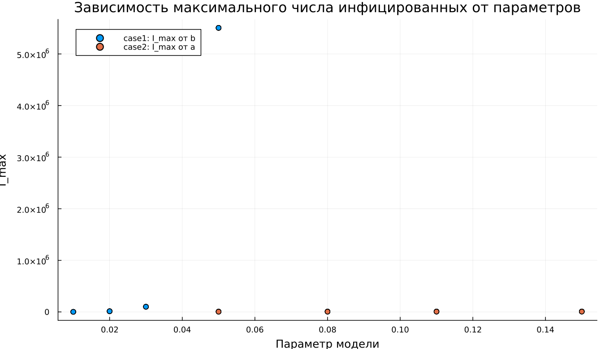

---
## Author
author:
  name: Абдуллахи Шугофа
  email: 1032225505@rudn.ru
  affiliation:
    - name: Российский университет дружбы народов
      country: Российская Федерация
      postal-code: 117198
      city: Москва
      address: ул. Миклухо-Маклая, д. 6

## Title
title: "Математическое моделирование"
subtitle: "Лабораторная работа № 6"
license: "CC BY"
---

# Цель работы

Изучить эпидемиологическую модель $SIR$ и проанализировать особенности её поведения при различных начальных условиях.

# Задание

1. Изучить математическую модель распространения эпидемии.
2. Построить графики изменения численности особей в трёх группах. Рассмотреть динамику эпидемического процесса в двух случаях: $I(0)\leq I^*$ и $I(0)>I^*$.

# Выполнение лабораторной работы

## Теоретические сведения

Рассмотрим простейшую модель распространения инфекционного заболевания. Пусть имеется изолированная популяция, состоящая из $N$ особей. В рамках модели всё население делится на три категории.

Первая категория — это восприимчивые к заболеванию, но ещё не инфицированные особи. Их количество обозначается через $S(t)$. Вторая категория — инфицированные особи, которые являются носителями и распространителями инфекции. Их численность обозначается через $I(t)$. Третья категория — особи, которые уже выздоровели и приобрели иммунитет к заболеванию. Их количество обозначается через $R(t)$.

Пока число инфицированных не превышает критический уровень $I^*$, предполагается, что заболевшие изолированы и не передают инфекцию здоровым. Если же выполняется условие $I(t)>I^*$, то инфицированные начинают заражать восприимчивых особей.

Следовательно, скорость изменения числа восприимчивых особей задаётся выражением:

$$
\frac{dS}{dt}=
 \begin{cases}
	-\alpha S &\text{, если $I(t) > I^*$}
	\\   
	0 &\text{, если $I(t) \leq I^*$}
 \end{cases}
$$

Так как каждая восприимчивая особь после заражения переходит в группу инфицированных, изменение числа инфекционных особей определяется разностью между количеством новых заражённых и количеством заболевших, которые переходят в группу выздоровевших. Поэтому:

$$
\frac{dI}{dt}=
 \begin{cases}
	\alpha S -\beta I &\text{, если $I(t) > I^*$}
	\\   
	-\beta I &\text{, если $I(t) \leq I^*$}
 \end{cases}
$$

Число выздоровевших, приобретающих иммунитет, изменяется по закону:

$$
\frac{dR}{dt} = \beta I
$$

Здесь коэффициент $\alpha$ характеризует интенсивность заражения, а коэффициент $\beta$ — скорость выздоровления. Для однозначного определения решения системы необходимо задать начальные условия. В начальный момент времени $t=0$ известны значения $S(0)$, $I(0)$ и $R(0)$.

Для анализа развития эпидемии необходимо рассмотреть два возможных режима:

1. $I(0) \leq I^*$;
2. $I(0)>I^*$.

### Задача

На острове началась эпидемия. Известно, что общая численность населения составляет

$$
N=11400.
$$

В момент времени $t=0$ число заболевших людей, являющихся распространителями инфекции, равно

$$
I(0)=250.
$$

Число здоровых людей, уже имеющих иммунитет, составляет

$$
R(0)=47.
$$

Тогда количество восприимчивых к болезни, но ещё здоровых людей в начальный момент времени определяется формулой:

$$
S(0)=N-I(0)-R(0).
$$

Необходимо построить графики изменения численности групп $S(t)$, $I(t)$ и $R(t)$, а также рассмотреть развитие эпидемии в двух случаях:

1. $I(0)\leq I^*$;
2. $I(0)>I^*$.

Для моделирования процесса и построения графиков использовались внешние файлы с программным кодом:





## Базовые эксперименты

### Первая модель (model_type = case1)

В первой модели система демонстрирует нетипичное и слабо реалистичное поведение. Количество восприимчивых особей $S(t)$ не изменяется с течением времени, что напрямую соответствует условию $dS/dt = 0$. При этом численность инфицированных $I(t)$ возрастает экспоненциально, а значение $R(t)$ уменьшается и может принимать отрицательные значения.

Такой результат противоречит смыслу классической эпидемиологической модели. В корректной модели число выздоровевших не должно становиться отрицательным, а рост инфицированных должен ограничиваться конечной численностью популяции. Следовательно, в данной системе отсутствует механизм, который сдерживает увеличение числа заболевших.

Фазовый портрет также подтверждает это наблюдение. Поскольку $S(t)$ остаётся постоянной величиной, траектория фактически превращается в вертикальную линию. Изменение состояния системы происходит только за счёт переменной $I(t)$, поэтому динамика становится одномерной.

Таким образом, первая модель описывает неограниченный рост числа инфицированных без выхода к устойчивому состоянию и не может рассматриваться как физически корректное описание эпидемического процесса.

### Вторая модель (model_type = case2)

Во второй модели наблюдается поведение, характерное для классической $SIR$-системы. Количество восприимчивых особей $S(t)$ постепенно уменьшается, поскольку часть здорового населения заражается и переходит в группу инфицированных.

Число инфицированных $I(t)$ сначала увеличивается, затем достигает максимального значения, после чего начинает снижаться. Это связано с тем, что со временем число восприимчивых особей уменьшается, и инфекция распространяется менее интенсивно. Количество выздоровевших $R(t)$, напротив, монотонно возрастает.

Такой характер динамики соответствует естественному развитию эпидемии в замкнутой популяции. В начале заболевания инфекция активно распространяется, затем достигается пик, после чего эпидемия постепенно затухает.

Фазовая траектория имеет вид незамкнутой кривой. Сначала наблюдается рост $I(t)$ при одновременном уменьшении $S(t)$, затем число инфицированных начинает снижаться. Это отражает прохождение системы через максимум заболеваемости и последующий переход к стационарному состоянию.

В отличие от первой модели, вторая модель демонстрирует устойчивое поведение:

$$
I(t) \to 0.
$$

При этом $S(t)$ стремится к некоторому остаточному уровню, а $R(t)$ достигает конечного значения.

## Параметрическое сканирование

### Траектории $S(t)$ для различных параметров

Анализ графиков $S(t)$ показывает, что модели по-разному реагируют на изменение параметров.

В первой модели, соответствующей случаю `case1`, значение $S(t)$ остаётся неизменным при любых выбранных параметрах. Это объясняется тем, что в данной модели выполняется условие $dS/dt = 0$. Следовательно, изменение коэффициентов не оказывает влияния на динамику восприимчивой группы.

Во второй модели, соответствующей случаю `case2`, число восприимчивых особей убывает. Скорость этого убывания определяется параметром $a$: чем больше значение $a$, тем быстрее уменьшается $S(t)$. Это соответствует более интенсивному заражению населения.

Основные результаты:

- в первой модели численность $S(t)$ остаётся постоянной;
- во второй модели $S(t)$ монотонно уменьшается;
- параметр $a$ определяет скорость сокращения группы восприимчивых.

### Траектории $I(t)$ для различных параметров

Для первой модели во всех рассмотренных случаях наблюдается экспоненциальный рост числа инфицированных $I(t)$. Увеличение параметра $b$ приводит к ускорению роста, из-за чего значения $I(t)$ становятся чрезмерно большими.

Во второй модели динамика инфицированных имеет другой характер. Сначала численность $I(t)$ растёт, затем достигает максимума и постепенно уменьшается. Параметр $a$ влияет как на высоту пика, так и на момент его достижения. При больших значениях $a$ максимум достигается быстрее, но спад также наступает раньше.

Итоговые наблюдения:

- первая модель приводит к неограниченному росту $I(t)$;
- вторая модель описывает типичную эпидемическую волну;
- параметры определяют скорость распространения инфекции и масштаб пика заболеваемости.

### Траектории $R(t)$ для различных параметров

В первой модели значение $R(t)$ уменьшается и со временем становится отрицательным. Это указывает на нарушение физического смысла переменной, так как число выздоровевших особей не может быть меньше нуля.

Во второй модели поведение $R(t)$ является корректным: число выздоровевших монотонно увеличивается и стремится к некоторому предельному значению. При более интенсивном заражении накопление выздоровевших происходит быстрее.

Следовательно:

- первая модель даёт нефизичные значения $R(t)$;
- во второй модели число выздоровевших возрастает естественным образом;
- параметры влияют на скорость выхода $R(t)$ к предельному уровню.

### Фазовые траектории для различных параметров

Фазовые портреты позволяют наглядно сравнить структуру двух моделей.

В первой модели все фазовые траектории имеют вырожденный вид и представляют собой почти вертикальные линии. Это связано с тем, что $S(t)$ не изменяется, а динамика системы фактически определяется только переменной $I(t)$.

Во второй модели фазовые траектории имеют характерную форму кривых, соответствующих эпидемическому процессу. Сначала число инфицированных растёт при уменьшении числа восприимчивых, затем $I(t)$ снижается, а $S(t)$ продолжает уменьшаться.

Таким образом, изменение параметров не меняет качественную природу моделей:

- первая модель остаётся вырожденной;
- вторая модель сохраняет реалистичный характер распространения эпидемии.

### Анализ метрики norm_final

Для сравнения результатов использовалась метрика:

$$
\text{norm\_final} = \sqrt{S(t_{final})^2 + I(t_{final})^2 + R(t_{final})^2}.
$$

В первой модели значение $\text{norm\_final}$ быстро увеличивается при росте параметра $b$. Это связано с тем, что $I(t)$ экспоненциально возрастает, а $R(t)$ уходит в отрицательную область, что приводит к увеличению нормы состояния системы.

Во второй модели значения этой метрики значительно меньше и изменяются более плавно. Это объясняется тем, что система постепенно выходит на стационарный режим, при котором число инфицированных стремится к нулю:

$$
I(t) \to 0.
$$

При этом $S(t)$ и $R(t)$ остаются конечными.

Основные выводы по метрике:

- в первой модели $\text{norm\_final}$ растёт без ограничения;
- во второй модели метрика характеризует конечное состояние системы;
- значение нормы позволяет количественно различить устойчивую и неустойчивую динамику.

### Анализ максимального числа инфицированных

Максимальное значение числа инфицированных $I_{max}$ существенно зависит от параметров модели.

В первой модели $I_{max}$ принимает крайне большие значения. Это является следствием отсутствия механизма насыщения и ограничения роста. При увеличении параметра $b$ максимум числа инфицированных резко возрастает.

Во второй модели значение $I_{max}$ остаётся конечным. Оно зависит от параметра $a$, который определяет интенсивность заражения. При больших значениях $a$ пик заболеваемости достигается быстрее, однако его величина ограничена общей численностью популяции и последующим спадом эпидемии.

Следовательно:

- первая модель приводит к неограниченному увеличению $I_{max}$;
- во второй модели максимум инфицированных остаётся конечным;
- параметр $a$ влияет на форму и высоту эпидемической волны.

### Время вычислений

Результаты бенчмаркинга показывают, что время численного решения во всех проведённых экспериментах остаётся малым и имеет порядок

$$
\sim 10^{-4} \text{ сек}.
$$

Для обеих моделей изменение параметров практически не влияет на вычислительные затраты. Небольшие колебания времени объясняются особенностями численного интегрирования и выбором адаптивного шага.

Можно сделать следующие выводы:

- обе модели быстро решаются численными методами;
- изменение параметров почти не влияет на время вычислений;
- даже при экспоненциальном росте решений в `case1` время работы алгоритма остаётся малым.

## Выводы

1. Первая модель (`case1`) показывает экспоненциальный и неограниченный рост числа инфицированных при постоянном количестве восприимчивых особей. Это указывает на нефизичность модели и отсутствие механизма стабилизации.
2. Вторая модель (`case2`) воспроизводит характерную динамику эпидемии: сначала происходит рост числа заболевших, затем достигается максимум, после чего инфекция постепенно затухает.
3. Фазовые портреты подтверждают различие между моделями: в первой модели траектории являются вырожденными, а во второй имеют форму кривых, соответствующих полноценной эпидемической динамике.
4. Параметры $a$ и $b$ существенно влияют на поведение системы: $a$ определяет скорость уменьшения числа восприимчивых, а $b$ влияет на интенсивность изменения числа инфицированных.
5. Метрика $\text{norm\_final}$ позволяет количественно сравнить модели: в первой модели она быстро возрастает, а во второй стабилизируется и отражает конечное состояние системы.
6. Максимальное число инфицированных $I_{max}$ в первой модели растёт без ограничения, тогда как во второй модели остаётся конечным и зависит от выбранных параметров.
7. Численное моделирование выполняется эффективно для обеих систем, а изменение параметров не приводит к существенному росту времени вычислений.

# Список литературы {.unnumbered}

1. [Конструирование эпидемиологических моделей](https://habr.com/ru/post/551682/)
2. [Зараза, гостья наша](https://nplus1.ru/material/2019/12/26/epidemic-math)
