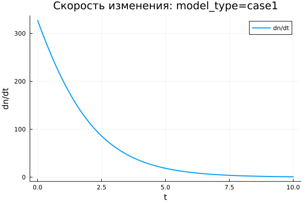
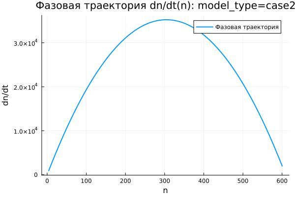
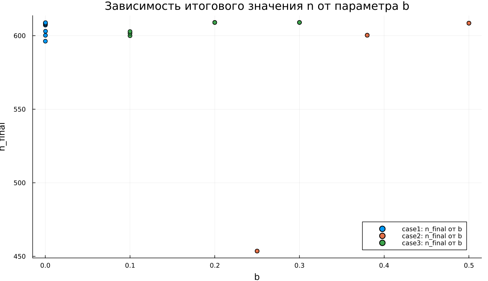
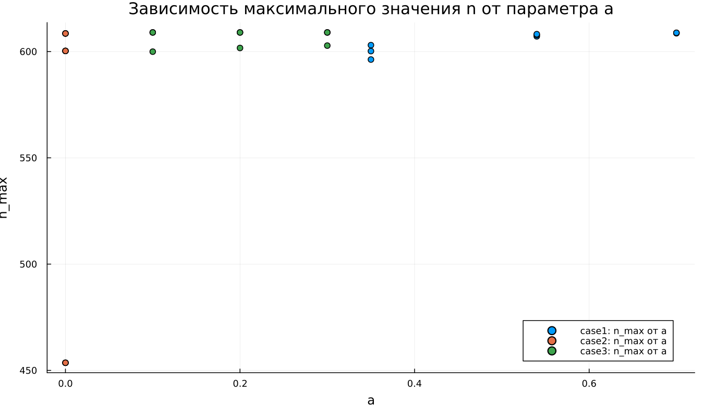
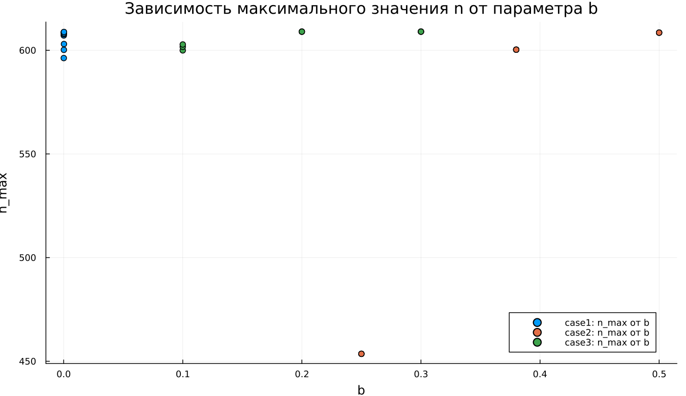
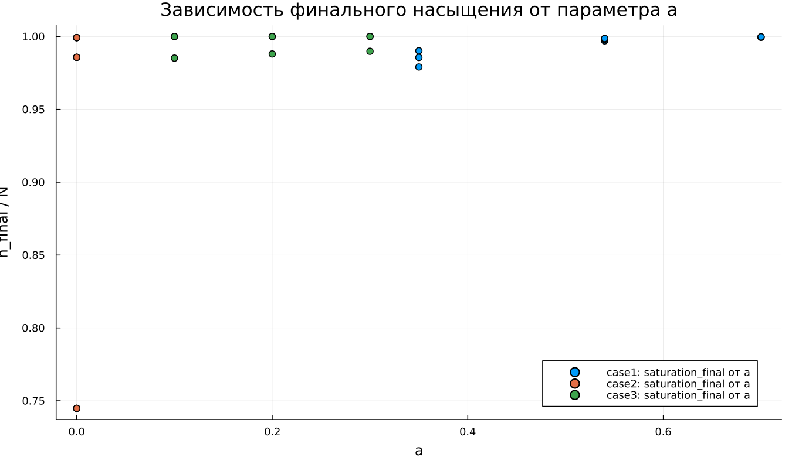
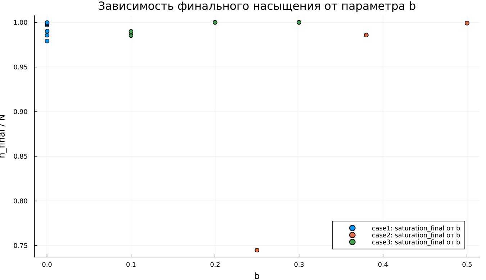
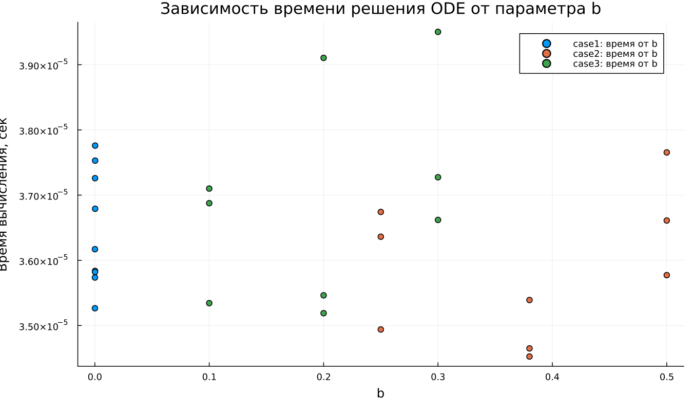

---
author:
  name: Абдуллахи Шугофа
  email: 1032225505@rudn.ru
  affiliation:
    - name: Российский университет дружбы народов
      country: Российская Федерация
      city: Москва
title: "Математическое моделирование"
subtitle: "Лабораторная работа №7"
license: "CC BY"
date: today
date-format: "YYYY-MM-DD"
---

# Вводная часть

## Цель работы

Исследовать модель эффективности рекламы и проанализировать, как информация о товаре распространяется среди потенциальных покупателей.

## Задание

1. Рассмотреть математическую модель рекламной кампании.
2. Построить графики распространения рекламы для трех заданных случаев.
3. Изучить изменение скорости распространения информации.
4. Провести параметрическое исследование моделей.
5. Сравнить поведение решений и сделать выводы.

# Теоретические сведения

## Модель распространения рекламы

Пусть:

- $N$ — общее число потенциальных покупателей;
- $n(t)$ — число покупателей, уже знающих о товаре;
- $t$ — время, прошедшее с начала рекламной кампании;
- $\frac{dn}{dt}$ — скорость роста числа информированных покупателей.

## Основная идея модели

Информация о товаре распространяется двумя путями:

1. Через прямое рекламное воздействие.
2. Через общение покупателей между собой.

Общий вид модели:

$$
\frac{dn}{dt} =
(\alpha_1(t) + \alpha_2(t)n(t))(N - n(t)).
$$

## Смысл множителей

Множитель $(N - n(t))$ показывает количество покупателей, которые еще не знают о товаре.

Если $n(t)$ приближается к $N$, то:

$$
N - n(t) \rightarrow 0.
$$

Поэтому скорость распространения рекламы постепенно уменьшается.

## Уровень насыщения

Величина $N$ задает предельный уровень охвата аудитории:

$$
n(t) \rightarrow N.
$$

При $n = N$ все потенциальные покупатели уже осведомлены о товаре, поэтому дальнейшее распространение информации прекращается.

# Постановка задачи

## Исходные данные

Заданы параметры:

$$
N = 609,
$$

$$
n(0) = 4.
$$

Необходимо построить графики $n(t)$ для трех моделей распространения рекламы и сравнить характер их динамики.

## Первая модель

$$
\frac{dn}{dt} =
(0.54 + 0.00016n(t))(N - n(t)).
$$

В первой модели основной вклад в распространение информации вносит рекламная кампания, а влияние общения между покупателями выражено слабее.

## Вторая модель

$$
\frac{dn}{dt} =
(0.000021 + 0.38n(t))(N - n(t)).
$$

Во второй модели определяющую роль играет передача информации от уже информированных покупателей к тем, кто еще не знает о товаре.

## Третья модель

$$
\frac{dn}{dt} =
(0.2\cos t + 0.2\cos 2t \cdot n(t))(N - n(t)).
$$

В третьей модели коэффициенты зависят от времени, поэтому интенсивность распространения информации меняется в ходе процесса.

# Базовые эксперименты

## Первая модель: динамика $n(t)$

## Первая модель: скорость изменения

## Первая модель: фазовая траектория

## Анализ первой модели

В первой модели функция $n(t)$ монотонно возрастает.

Основные особенности:

- решение постепенно приближается к уровню $N = 609$;
- наиболее быстрый рост наблюдается в начале процесса;
- затем скорость распространения уменьшается;
- значение $n(t)$ не превышает уровень насыщения.

## Вывод по первой модели

Первая модель описывает насыщаемый рост.

При приближении к $N$ множитель $(N - n)$ становится малым, поэтому:

$$
\frac{dn}{dt} \rightarrow 0.
$$

Состояние $n = N$ является равновесным.

# Вторая модель

## Вторая модель: динамика $n(t)$

## Вторая модель: скорость изменения

## Вторая модель: фазовая траектория

## Анализ второй модели

Во второй модели рост происходит намного быстрее, чем в первой.

График $n(t)$ имеет S-образный вид:

- в начале процесс развивается медленно;
- затем скорость резко возрастает;
- после прохождения максимума рост замедляется;
- решение быстро приближается к $N$.

## Максимальная скорость

Во второй модели скорость распространения рекламы имеет выраженный максимум.

Причина связана с действием двух противоположных факторов:

- множитель $bn$ усиливает распространение информации;
- множитель $(N - n)$ ограничивает дальнейший рост.

Максимум скорости достигается внутри интервала, а не в начальный момент времени.

## Расчет максимума скорости

Для второй модели скорость можно записать как:

$$
v(n) = (a + bn)(N - n).
$$

Максимум находится из условия:

$$
\frac{dv}{dn} = 0.
$$

Тогда:

$$
bN - a - 2bn = 0,
$$

откуда:

$$
n_* = \frac{bN-a}{2b}.
$$

При $a = 0.000021$, $b = 0.38$, $N = 609$:

$$
n_* \approx 304{,}5.
$$

Момент достижения максимальной скорости:

$$
t_* \approx 0{,}0142.
$$

# Третья модель

## Третья модель: динамика $n(t)$

## Третья модель: скорость изменения

## Третья модель: фазовая траектория

## Анализ третьей модели

Третья модель также приводит к насыщению.

Ее особенность заключается в наличии периодических множителей:

$$
\cos t,\quad \cos 2t.
$$

На выбранном коротком интервале эти функции остаются положительными, поэтому решение не переходит к колебательному режиму, а продолжает монотонно возрастать.

## Вывод по третьей модели

Третья модель описывает насыщаемый рост с коэффициентами, изменяющимися во времени.

Несмотря на тригонометрические множители, общий характер динамики сохраняется:

$$
n(t) \rightarrow N.
$$

# Сравнение базовых моделей

## Качественное различие

| Характеристика | case1 | case2 | case3 |
|---|---|---|---|
| Вид роста | монотонный | S-образный | S-образный |
| Скорость в начале | максимальная | малая | малая |
| Максимум $\frac{dn}{dt}$ | в начале | внутри интервала | внутри интервала |
| Предельное значение | $N$ | $N$ | $N$ |
| Коэффициенты | постоянные | постоянные | зависят от времени |

## Общая особенность

Во всех трех моделях присутствует множитель:

$$
N - n(t).
$$

Он ограничивает рост и обеспечивает выход решения на уровень насыщения.

# Параметрическое исследование

## Зависимость $n_{final}$ от параметра $a$

## Анализ зависимости $n_{final}(a)$

Большинство точек расположено около уровня $N = 609$.

Это означает, что при большей части наборов параметров система успевает приблизиться к насыщению.

Исключение наблюдается во второй модели при малом значении параметра $a$, когда процесс не успевает завершиться за выбранное время моделирования.

## Зависимость $n_{final}$ от параметра $b$

## Анализ зависимости $n_{final}(b)$

Параметр $b$ определяет силу влияния общения между покупателями.

При больших значениях $b$ информация распространяется быстрее.

Если значение $b$ недостаточно велико, система может не успеть достичь уровня насыщения за заданный расчетный интервал.

# Максимальные значения

## Зависимость $n_{max}$ от параметра $a$

## Зависимость $n_{max}$ от параметра $b$

## Анализ $n_{max}$

Так как решения в базовых экспериментах возрастают монотонно, величина $n_{max}$ почти совпадает с $n_{final}$.

Если модель достигает насыщения, то:

$$
n_{max} \approx N.
$$

Если расчетного времени недостаточно, то $n_{max}$ остается ниже предельного уровня $N$.

# Финальное насыщение

## Зависимость насыщения от параметра $a$

## Зависимость насыщения от параметра $b$

## Метрика насыщения

Для оценки степени завершенности процесса использовалась метрика:

$$
\text{saturation\_final} =
\frac{n_{final}}{N}.
$$

Если значение близко к $1$, система почти полностью достигла уровня насыщения.

## Интерпретация насыщения

Для большинства экспериментов выполняется соотношение:

$$
\frac{n_{final}}{N} \approx 1.
$$

Это означает почти полный охват аудитории.

Пониженные значения показывают, что процесс распространения рекламы еще находится в переходной фазе.

# Бенчмаркинг

## Время решения от параметра $a$

## Время решения от параметра $b$

## Анализ времени вычислений

Бенчмаркинг показал:

- все три модели решаются быстро;
- время вычислений имеет порядок $10^{-5}$ секунды;
- изменение параметров почти не влияет на вычислительные затраты;
- третья модель немного сложнее из-за вычисления $\cos t$ и $\cos 2t$.

# Итоги

## Основные результаты

1. Все три модели описывают насыщаемый рост.
2. Предельный уровень охвата равен $N = 609$.
3. В первой модели максимальная скорость наблюдается в начале процесса.
4. Вторая модель демонстрирует наиболее резкий S-образный рост.
5. Третья модель учитывает изменение коэффициентов во времени.
6. Для второй модели максимум скорости достигается примерно при $t \approx 0{,}0142$.

## Выводы

1. Первая модель (case1) описывает монотонное приближение $n(t)$ к уровню $N$.

2. Вторая модель (case2) показывает S-образный рост и имеет внутренний максимум скорости распространения рекламы.

3. Третья модель (case3) также приводит к насыщению, но использует коэффициенты, зависящие от времени.

4. Параметры $a$ и $b$ влияют главным образом на скорость выхода к насыщению.

5. Метрики $n_{final}$, $n_{max}$ и $\text{saturation\_final}$ позволяют количественно сравнить поведение моделей.

6. Численное решение всех трех моделей выполняется эффективно.

7. Все рассмотренные модели приводят к одному предельному состоянию, но отличаются скоростью роста и характером изменения $\frac{dn}{dt}$.

# Список литературы {.unnumbered}

1. [Модель Мальтуса](http://km.mmf.bsu.by/courses/2018/mathmod1/MM_LB1_Population_2019.pdf)
2. [Логистическая модель роста](https://studopedia.ru/29_5129_logisticheskaya-model-rosta.html)
