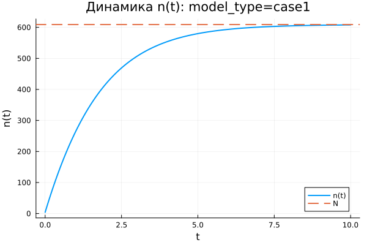
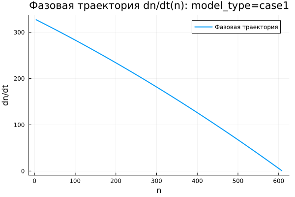
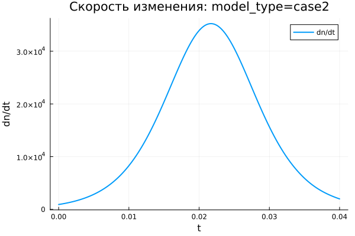
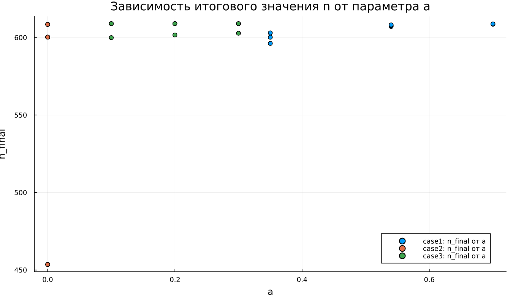

---
## Author
author:
  name: Абдуллахи Шугофа
  email: 1032225505@rudn.ru
  affiliation:
    - name: Российский университет дружбы народов
      country: Российская Федерация
      postal-code: 117198
      city: Москва
      address: ул. Миклухо-Маклая, д. 6

## Title
title: "Математическое моделирование"
subtitle: "Лабораторная работа № 7"
license: "CC BY"
---

# Цель работы

Исследовать математическую модель эффективности рекламной кампании.

# Задание

1. Изучить модель распространения рекламы.
2. Построить графики динамики распространения рекламы для заданных случаев.
3. Для второго случая определить момент времени, при котором скорость распространения рекламы принимает максимальное значение.

# Выполнение лабораторной работы

## Теоретические сведения

# Выполнение лабораторной работы

## Теоретические сведения

Рассматривается рекламная кампания нового товара или услуги. Ее необходимо организовать так, чтобы будущая прибыль от продаж превышала затраты на продвижение. На начальном этапе расходы на рекламу могут быть больше полученной прибыли, поскольку о товаре знает лишь небольшая часть потенциальных покупателей. Позднее, по мере роста числа информированных потребителей и увеличения продаж, прибыль начинает возрастать. После насыщения рынка дальнейшее рекламирование теряет практический смысл.

Пусть торговая сеть реализует продукцию, о которой в момент времени $t$ среди $N$ потенциальных покупателей знают только $n$ человек. Для ускорения сбыта запускается реклама через радио, телевидение и другие средства массовой информации. После начала кампании сведения о товаре распространяются не только через рекламные каналы, но и через общение покупателей между собой. Поэтому скорость изменения числа людей, осведомленных о продукции, зависит от количества уже информированных покупателей и от числа тех, кто еще не знает о товаре.

Модель рекламной кампании задается следующими величинами. Производная $\frac{dn}{dt}$ показывает скорость изменения числа потребителей, которые узнали о товаре и готовы его приобрести. Переменная $t$ обозначает время, прошедшее с момента запуска рекламной кампании. Величина $N$ задает общее число потенциальных платежеспособных покупателей, а функция $n(t)$ описывает число уже информированных клиентов.

Первый вклад в скорость распространения информации связан с непосредственным действием рекламной кампании. Он пропорционален числу покупателей, еще не знакомых с товаром, и записывается в виде $\alpha_1(t)(N-n(t))$, где $\alpha_1(t)>0$ характеризует интенсивность рекламы и зависит от текущих затрат на продвижение.

Второй вклад возникает из-за передачи информации между потребителями. Покупатели, уже знающие о товаре, могут рассказывать о нем другим людям. Этот механизм называют «сарафанным радио». Его влияние описывает выражение $\alpha_2(t)n(t)(N-n(t))$. При увеличении числа информированных покупателей вклад этого механизма возрастает.

Математическая модель распространения рекламы имеет вид:

$$
\frac{dn}{dt} = (\alpha_1(t) + \alpha_2(t)n(t))(N-n(t)).
$$

Если $\alpha_1(t) >> \alpha_2(t)$, модель становится близкой к модели Мальтуса. Ее решение имеет следующий характер:

{ #fig:001 width=70% height=70% }

Если, наоборот, $\alpha_1(t) << \alpha_2(t)$, уравнение приводит к логистической кривой:

{ #fig:002 width=70% height=70% }

## Задача

Построить графики распространения рекламы для моделей, заданных уравнениями:

1. $\frac{dn}{dt} = (0.54 + 0.00016n(t))(N-n(t))$
2. $\frac{dn}{dt} = (0.000021 + 0.38n(t))(N-n(t))$
3. $\frac{dn}{dt} = (0.2\cos{t} + 0.2\cos{2t}n(t))(N-n(t))$

Объем аудитории равен $N = 609$. В начальный момент времени о товаре знают $4$ человека.

Для второго случая требуется определить момент времени, когда скорость распространения рекламы достигает максимума.

Для моделирования процесса и построения графиков использовались внешние файлы с программным кодом:





## Базовые эксперименты

### Первая модель (model_type = case1)

В первой модели функция $n(t)$ возрастает монотонно. В начале процесса значение $n$ значительно меньше предельного уровня $N = 609$, поэтому количество информированных покупателей увеличивается быстро. Затем, по мере приближения $n(t)$ к $N$, темп роста постепенно снижается.

На графике динамики видно, что к концу расчетного интервала $t \in [0; 10]$ решение почти достигает уровня насыщения. Горизонтальная пунктирная линия показывает значение $N$, к которому стремится численное решение. Функция $n(t)$ не превосходит верхний предел, а приближается к нему снизу.

График скорости изменения показывает, что наибольшее значение $\frac{dn}{dt}$ наблюдается в начальный момент времени. Затем скорость монотонно уменьшается и стремится к нулю. Следовательно, основной прирост числа информированных покупателей происходит в начале процесса, после чего система переходит к насыщению.

Фазовая траектория $\frac{dn}{dt}(n)$ подтверждает этот вывод. При малых значениях $n$ скорость изменения максимальна, а при приближении к $N$ она почти обращается в ноль. Траектория имеет убывающий характер, поэтому модель описывает быстрый начальный рост с последующим замедлением.

Первая модель демонстрирует устойчивое стремление к предельному уровню $N$. Состояние $n = N$ является равновесным: при достижении насыщения множитель $(N - n)$ обращает правую часть уравнения в ноль.

### Вторая модель (model_type = case2)

Во второй модели функция $n(t)$ растет значительно быстрее, чем в первой. Расчетный интервал выбран очень коротким: $t \in [0; 0{,}04]$. Несмотря на это, решение почти достигает уровня $N = 609$. Причина заключается в большом значении коэффициента $b$, который усиливает нелинейный вклад слагаемого $bn$.

График $n(t)$ имеет выраженную S-образную форму. В начале рост относительно медленный, потому что число информированных покупателей еще мало. Затем скорость резко увеличивается. После этого рост снова замедляется из-за приближения к предельному уровню $N$. В результате система быстро выходит на насыщение.

График $\frac{dn}{dt}$ содержит один ярко выраженный максимум. Сначала скорость изменения увеличивается, затем достигает пикового значения, а после этого убывает почти до нуля. Модель описывает режим ускоренного распространения информации с дальнейшим торможением из-за множителя $(N - n)$.

Фазовая траектория $\frac{dn}{dt}(n)$ имеет форму, близкую к параболе. При малых значениях $n$ скорость изменения невелика. Далее она возрастает и достигает максимума примерно при $n \approx 304{,}5$, после чего снижается при движении к $N$. Здесь одновременно действуют два фактора: самоускорение через множитель $bn$ и ограничение роста через множитель $(N - n)$.

Для второго случая максимум скорости можно определить аналитически. Правая часть уравнения имеет вид:

$$
v(n) = (a + bn)(N-n),
$$

где $a = 0.000021$, $b = 0.38$, $N = 609$. Максимум функции $v(n)$ находится из условия $\frac{dv}{dn}=0$:

$$
\frac{dv}{dn} = bN - a - 2bn = 0.
$$

Отсюда получаем значение $n$, при котором скорость распространения максимальна:

$$
n_* = \frac{bN-a}{2b}.
$$

После подстановки параметров:

$$
n_* = \frac{0.38 \cdot 609 - 0.000021}{2 \cdot 0.38} \approx 304{,}5.
$$

С учетом начального условия $n(0)=4$ момент достижения этого значения можно найти из решения уравнения:

$$
\frac{dn}{dt} = (a+bn)(N-n).
$$

Для второго случая получаем приближенное значение:

$$
t_* \approx 0{,}0142.
$$

Следовательно, максимальная скорость распространения рекламы во второй модели достигается примерно в момент времени $t \approx 0{,}0142$.

Вторая модель описывает более резкий переход к насыщению. В отличие от первой модели, максимум скорости возникает не в начальный момент, а внутри расчетного интервала, когда число информированных покупателей уже достаточно велико, но запас до уровня $N$ еще остается существенным.

### Третья модель (model_type = case3)

В третьей модели функция $n(t)$ также монотонно возрастает и быстро приближается к уровню $N = 609$. На графике видно, что основная часть роста приходится на начальный участок интервала $t \in [0; 0{,}15]$. Затем кривая практически совпадает с горизонтальным уровнем насыщения.

Особенность третьей модели связана с наличием периодических множителей $\cos(t)$ и $\cos(2t)$. На выбранном коротком интервале времени эти функции остаются положительными и близкими к единице. Поэтому они не формируют колебательный режим, а только меняют интенсивность роста.

График скорости $\frac{dn}{dt}$ содержит один заметный пик. В начале процесса скорость увеличивается, затем достигает максимального значения, после чего быстро стремится к нулю. После выхода $n(t)$ на уровень насыщения дальнейшее изменение практически прекращается.

Фазовая траектория $\frac{dn}{dt}(n)$ по форме близка к параболической. Скорость изменения мала при небольших значениях $n$, затем увеличивается и достигает максимума примерно в средней части диапазона. При приближении к $N$ множитель $(N - n)$ уменьшает скорость до нуля.

Третья модель показывает насыщаемый рост с коэффициентами, зависящими от времени. На рассматриваемом интервале периодические множители не меняют общий характер процесса: решение остается монотонным, достигает предельного уровня и переходит в равновесное состояние.

## Сравнение базовых экспериментов

Во всех трех моделях функция $n(t)$ стремится к одному предельному уровню $N = 609$. Это объясняется наличием множителя $(N - n)$, который снижает скорость роста при приближении к насыщению и обращает ее в ноль при $n = N$.

Первая модель характеризуется быстрым стартом и дальнейшим плавным замедлением. Максимальная скорость наблюдается в начальный момент, а фазовая траектория имеет убывающий вид.

Вторая модель демонстрирует наиболее резкий S-образный рост. Скорость сначала увеличивается, затем достигает максимума и после этого убывает. Фазовая траектория имеет выраженную параболическую форму, что указывает на наличие внутренней точки максимального роста.

Третья модель по характеру близка ко второй, но включает временную зависимость коэффициентов. На рассматриваемом интервале эта зависимость не приводит к колебаниям, поскольку значения $\cos(t)$ и $\cos(2t)$ остаются положительными.

Все три модели приводят систему к насыщению, но отличаются скоростью перехода к предельному состоянию и характером изменения производной $\frac{dn}{dt}$.

## Параметрическое сканирование

### Зависимость итогового значения $n$ от параметра $a$

На графике представлена зависимость итогового значения $n_{final}$ от параметра $a$ для трех моделей. Большинство точек находится около уровня $N = 609$, что указывает на почти полное насыщение к завершению расчетного интервала.

Для первой модели значения $n_{final}$ остаются близкими к $N$ при всех рассмотренных значениях параметра $a$. Следовательно, изменение $a$ в выбранном диапазоне не нарушает общий характер процесса: решение продолжает стремиться к предельному уровню.

Во второй модели заметен один выброс при малом значении $a$. В этом эксперименте итоговое значение $n$ существенно ниже $N$ и составляет примерно $n_{final} \approx 455$. Причина состоит в том, что при выбранной комбинации параметров процесс не успевает выйти на насыщение за короткий временной интервал.

Для третьей модели значения $n_{final}$ также располагаются в верхней части графика и остаются близкими к $N$. Периодические коэффициенты при выбранных параметрах не вызывают заметного снижения итогового уровня.

В целом параметр $a$ влияет не только на конечное значение, но и на скорость приближения к насыщению. При малой интенсивности роста система может не успеть достичь уровня $N$ за заданное время моделирования.

### Зависимость итогового значения $n$ от параметра $b$

График зависимости $n_{final}$ от параметра $b$ показывает, что для большей части экспериментов итоговое значение располагается около $N = 609$. Это подтверждает устойчивое стремление решений к насыщению.

Для первой модели точки сгруппированы около малых значений $b$, поскольку в параметрическом сканировании использовался небольшой диапазон этого коэффициента. При этом итоговые значения $n$ остаются близкими к предельному уровню.

Во второй модели влияние параметра $b$ выражено сильнее. При одном из значений $b$ итоговое значение $n$ оказывается заметно ниже уровня насыщения. Это означает, что при выбранной комбинации параметров рост недостаточно быстр, и система не успевает приблизиться к $N$ за время расчета.

Для третьей модели точки находятся около $N$, что указывает на сохранение режима насыщаемого роста. Даже при наличии множителей $\cos(t)$ и $\cos(2t)$ итоговое значение остается близким к верхнему пределу.

График показывает, что параметр $b$ играет важную роль в моделях с нелинейным усилением роста через слагаемое $bn$. При недостаточном значении коэффициента выход на насыщение замедляется.

### Зависимость максимального значения $n$ от параметра $a$

На графике показана зависимость максимального значения $n_{max}$ от параметра $a$. Поскольку во всех базовых экспериментах функция $n(t)$ возрастает монотонно, величина $n_{max}$ практически совпадает с итоговым значением $n_{final}$.

Для первой модели максимальные значения располагаются около уровня $N = 609$. Это показывает, что решение достигает верхней границы или подходит к ней достаточно близко.

Во второй модели снова выделяется точка с меньшим значением $n_{max}$. Это означает, что на всем временном интервале решение не смогло приблизиться к насыщению. Причина связана не со сменой направления динамики, а с недостаточной скоростью роста на заданном интервале времени.

Для третьей модели максимальные значения сохраняются около $N$. Следовательно, переменные во времени коэффициенты не мешают достижению высокого уровня $n$ при выбранном диапазоне параметров.

Поскольку $n_{max}$ отражает наибольшее значение решения за время расчета, этот график подтверждает выводы, полученные при анализе $n_{final}$.

### Зависимость максимального значения $n$ от параметра $b$

График зависимости $n_{max}$ от параметра $b$ по структуре близок к графику $n_{final}(b)$. Это связано с монотонным ростом решений: максимум достигается в конце расчетного интервала или рядом с ним.

Для первой модели значения $n_{max}$ сосредоточены около $N$. Изменение параметра $b$ в малом диапазоне не приводит к заметному снижению максимального уровня.

Во второй модели одна точка расположена значительно ниже остальных. Это показывает, что при соответствующей комбинации параметров модель не выходит на насыщение. Остальные эксперименты для второй модели дают значения около верхнего предела.

Для третьей модели все точки остаются вблизи $N$, что говорит о стабильном достижении насыщения. Параметр $b$ влияет на скорость роста, но в выбранных экспериментах не меняет конечный характер динамики.

График подтверждает, что максимальный уровень $n$ в первую очередь ограничивается величиной $N$, а параметры $a$ и $b$ определяют скорость приближения к этому пределу.

### Зависимость финального насыщения от параметра $a$

На графике представлена зависимость относительного итогового насыщения $\frac{n_{final}}{N}$ от параметра $a$. Значение, близкое к $1$, означает почти полное достижение предельного уровня $N$.

Для первой модели насыщение находится около $1$ при всех рассмотренных значениях $a$. Это показывает, что модель стабильно приходит к предельному состоянию.

Во второй модели наблюдается одна точка с насыщением около $0{,}75$. Это означает, что в этом эксперименте итоговое значение составляет примерно три четверти от возможного максимума. Остальные точки расположены значительно выше и близки к полному насыщению.

Для третьей модели значения $\frac{n_{final}}{N}$ находятся вблизи $1$. Это указывает на почти полное насыщение даже при наличии временной зависимости коэффициентов.

Нормировка на $N$ делает график удобным для сравнения моделей, поскольку позволяет оценивать не абсолютное значение $n$, а степень приближения к верхнему пределу.

### Зависимость финального насыщения от параметра $b$

График зависимости $\frac{n_{final}}{N}$ от параметра $b$ показывает, что большинство экспериментов завершается почти полным насыщением. Значения располагаются около $1$, что соответствует достижению уровня $N$.

Для первой модели насыщение остается высоким при всех рассмотренных значениях $b$. Значит, даже малые значения параметра не мешают решению приблизиться к предельному уровню за выбранное время.

Во второй модели снова присутствует одно пониженное значение. В этом эксперименте система достигает только около $75\%$ от уровня $N$. Этот результат показывает чувствительность второй модели к сочетанию параметров и длине расчетного интервала.

Для третьей модели точки располагаются вблизи полного насыщения. Временные множители не создают заметного снижения итогового уровня.

В целом график подтверждает стремление системы к насыщению. Однако при отдельных наборах параметров время моделирования может оказаться недостаточным для выхода на уровень $N$.

## Бенчмаркинг

### Зависимость времени решения ODE от параметра $a$

На графике показано медианное время численного решения задачи ОДУ при различных значениях параметра $a$. Время вычислений находится примерно в диапазоне от $3{,}45 \cdot 10^{-5}$ до $3{,}95 \cdot 10^{-5}$ секунды.

Для всех трех моделей значения времени близки друг к другу. Это означает, что рассматриваемые задачи имеют малую вычислительную сложность, а изменение параметров не вызывает резкого роста затрат на интегрирование.

Явная монотонная зависимость времени решения от параметра $a$ не проявляется. Точки имеют небольшой разброс, который может быть связан с особенностями работы численного метода, кэшированием, текущей системной нагрузкой и погрешностью измерения при малых временах выполнения.

Третья модель в отдельных точках требует немного больше времени. Это можно объяснить более сложной правой частью уравнения, где дополнительно вычисляются функции $\cos(t)$ и $\cos(2t)$.

В целом бенчмаркинг показывает, что все три модели решаются быстро, а различия между ними по времени вычислений остаются небольшими.

### Зависимость времени решения ODE от параметра $b$

На графике представлена зависимость времени решения ОДУ от параметра $b$. Как и в случае с параметром $a$, значения времени находятся в узком диапазоне порядка $10^{-5}$ секунды.

Для первой модели точки сосредоточены около малых значений $b$, что соответствует выбранной сетке параметров. Время решения немного колеблется, но устойчивый рост или спад не наблюдается.

Для второй модели значения времени также меняются с небольшим разбросом. Даже при увеличении $b$ вычислительные затраты не возрастают существенно. Это показывает, что выбранный численный метод справляется с задачей без заметного усложнения интегрирования.

Для третьей модели часть точек располагается выше, чем у первых двух моделей. Вероятная причина связана с более сложной формулой правой части, содержащей тригонометрические множители. При этом различие остается небольшим и не меняет общий вывод о высокой скорости расчета.

График показывает, что параметр $b$ сильнее влияет на динамику решения, чем на время вычислений. В рамках проведенного сканирования вычислительная стоимость остается стабильной для всех трех моделей.

## Выводы

1. Первая модель (case1) описывает насыщаемый рост величины $n(t)$. Решение монотонно возрастает и постепенно приближается к предельному уровню $N = 609$, не превышая его.

2. Во второй модели (case2) наблюдается самый резкий рост. Функция $n(t)$ имеет выраженную S-образную форму: сначала рост идет медленно, затем ускоряется, после чего замедляется при приближении к уровню насыщения.

3. Третья модель (case3) также приводит систему к насыщению, но отличается наличием переменных во времени коэффициентов $\cos(t)$ и $\cos(2t)$. На выбранном интервале они не вызывают колебаний, поэтому решение остается монотонным.

4. Во всех трех моделях предельное значение $N$ играет роль уровня насыщения. При приближении $n(t)$ к $N$ множитель $(N - n)$ уменьшает скорость роста, а при $n = N$ правая часть уравнения обращается в ноль.

5. Графики скорости изменения $\frac{dn}{dt}$ показывают различия между моделями. В первой модели скорость максимальна в начальный момент и затем монотонно убывает. Во второй и третьей моделях скорость сначала возрастает, достигает максимума, а затем снижается почти до нуля.

6. Для второй модели максимум скорости достигается примерно в момент времени $t \approx 0{,}0142$. В этот момент число информированных покупателей составляет около $n_* \approx 304{,}5$.

7. Фазовые траектории $\frac{dn}{dt}(n)$ подтверждают характер динамики. Для первой модели траектория имеет убывающий вид, а для второй и третьей моделей — форму, близкую к параболической, с внутренней точкой максимальной скорости роста.

8. Параметры $a$ и $b$ влияют прежде всего на скорость выхода к насыщению. При достаточно больших значениях параметров система быстро достигает уровня $N$, а при отдельных комбинациях, особенно во второй модели, решение не успевает полностью выйти на насыщение за заданное время.

9. Метрики $n_{final}$ и $n_{max}$ в большинстве экспериментов близки к $N = 609$, что указывает на достижение предельного состояния. Заметные отклонения связаны не с изменением направления динамики, а с недостаточной длительностью расчетного интервала для некоторых наборов параметров.

10. Метрика $\text{saturation\_final} = \frac{n_{final}}{N}$ позволяет оценить степень достижения насыщения. Значения, близкие к единице, показывают почти полный выход системы на предельный уровень, а пониженные значения указывают на незавершенный переходный процесс.

11. Бенчмаркинг показал, что численное решение всех трех моделей выполняется быстро. Время вычислений имеет порядок $10^{-5}$ секунды, а изменение параметров $a$ и $b$ почти не влияет на вычислительные затраты.

12. Третья модель немного сложнее с вычислительной точки зрения, поскольку правая часть содержит тригонометрические функции. Однако разница во времени решения остается небольшой и не оказывает существенного влияния на общую эффективность расчетов.

13. В целом все три модели описывают процесс насыщаемого роста, но различаются скоростью перехода к предельному состоянию и формой зависимости $\frac{dn}{dt}$ от времени и от значения $n$.

# Список литературы {.unnumbered}

1. [Модель Мальтуса](http://km.mmf.bsu.by/courses/2018/mathmod1/MM_LB1_Population_2019.pdf)
2. [Логистическая модель роста](https://studopedia.ru/29_5129_logisticheskaya-model-rosta.html)
